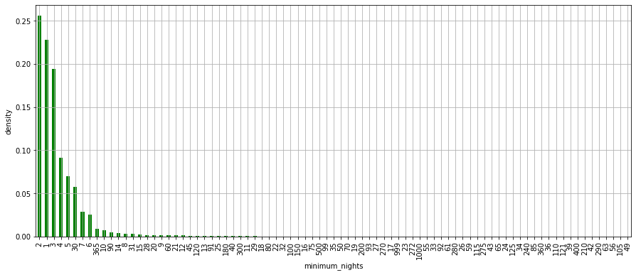
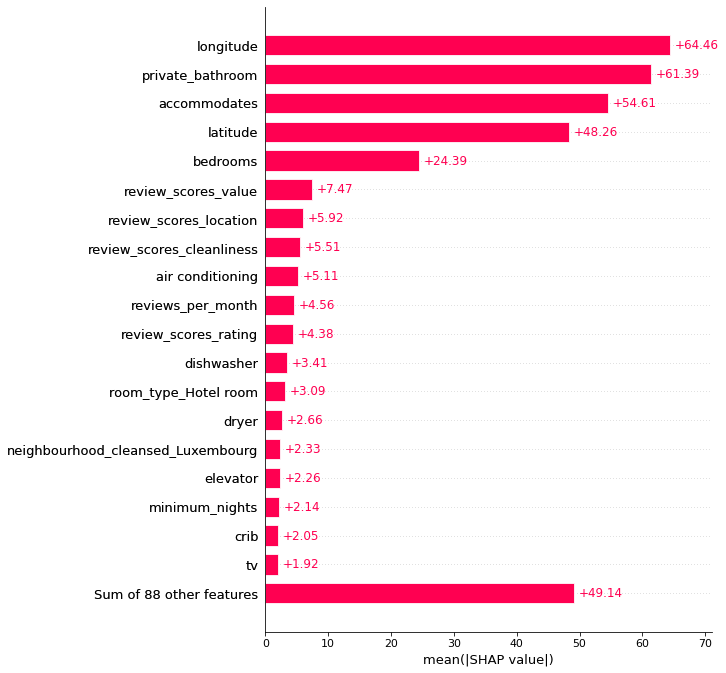
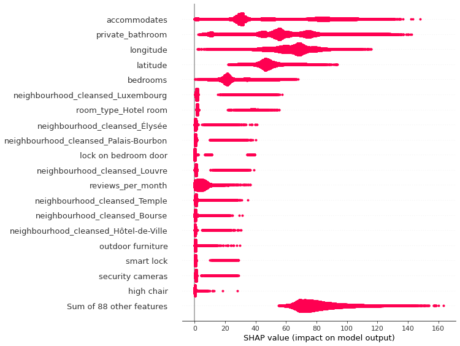
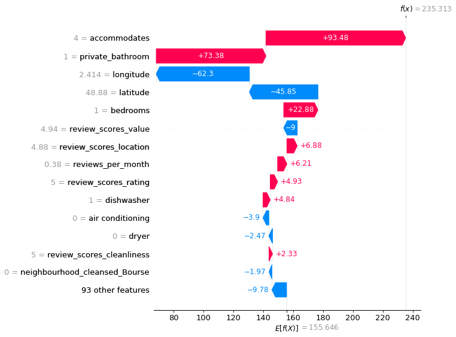
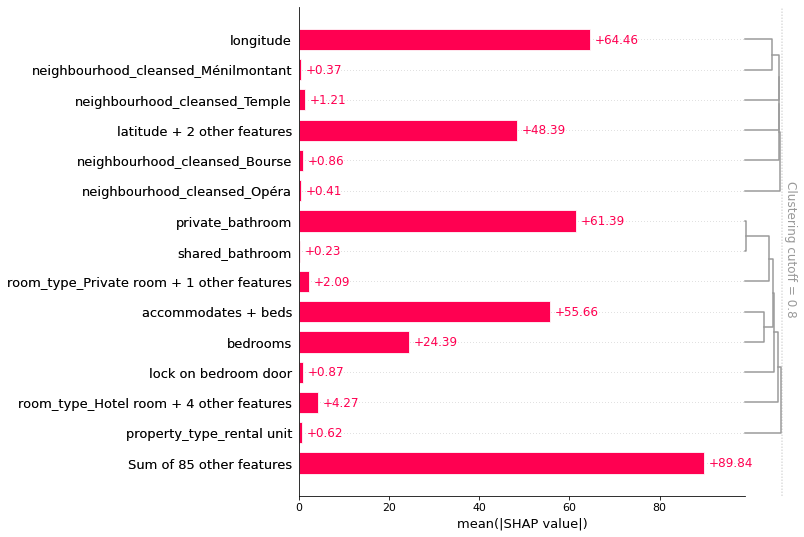

# Airbnb analytics, visualisations and price prediction
## Airbnb Paris quarters Q3 - Q4 2022 scrapes (March-Dec 2022)

## 1. Introduction

Airbnb, Inc. is an American San Francisco-based company operating an online marketplace for short-term homestays and experiences. The company acts as a broker and charges a commission from each booking. The company not only have revolutionized the tourism industry but has also been facilitated an unaffordable increase in home rents, and for a lack of regulation (https://en.wikipedia.org/wiki/Airbnb).

With this in mind, the objectives of these project were:

- Visualise the properties offered in the 20 Arrondissements of Paris during Quarters Q2 - Q4 of 2022
- Find features that impact the price of a listing
- Identify potential inactive listing with outlier prices - noise
- Identify the most expensive and cheapest neighbourhoods
- Identyfied the type of accommodations and properties more often offered by airbnb
- Identify listing that offered for long-term stays
- Processing the data to predict the listing price per night with Machine Learning algorithms 
- Optimize the best model hyperparameters
- Best model explainability - XAI Shapley number computation

Airbnb datasets Q2-Q4 2022 can be sourced from http://insideairbnb.com/get-the-data/

## 2. Libraries  and frameworks used

* pandas
* numpy
* matplotlib
* sklearn
* xgboost
* lightgbm
* skorch
* missigno
* joblib
* shap

GIS  libraries

* geopandas
* contextily
* folium

Frameworks

* PyTorch

## 2. Geographical listing distribution

- Interactive map available for airbnb_paris.ipynb https://ace-aitech.github.io/ace-aitech.github.io-airbnb_paris/

  
  <figcaption>
      <h4>Listings density per neighbourhood</h4>
  </figcaption>
</figure>

## 3. Properties, rooms type quaters density and price frequency

* 75 % of the listing has minimum_nights up to 4. 
* There are 7232 listings in airbnb Paris that required a minimun_nights stay of 30 nights covering the 8.74% unique listings from Q2-Q4 2022.
* The most common property_type  is **rental unit**
* Most common type of room **Entire home/apt**

**Note** The listings were recategorise in short and long-term if the minimum_nights was >=30

  

## 3.Price visualisation

* Most expensive room type is **Hotel room**
* The cheapest accommodation is  **Shared room**
* Most expensive properties are floor and Villa 
* Cheapest neighbourhoods Ménilmontant $101.787, Buttes-Chaumont $116.75
* Most expensive neighbourhoods are Élysée $260.112, Louvre $257.11

There are 7232 listings in airbnb Paris that required a minimun_nights stay of 30 nights covering the 8.74% unique listings from Q2-Q4 2022.

## 3. Top ten amenities

#### **Top 10 amenities**

|amenity|frequency|
|---|---|
|wifi|88783|
|kitchen|85683|
|essentials|83260|
|heating|83255|
|long term stays allowed|77452|
|smoke alarm|74465|
|hot water|73666|
|hair dryer|73414|
|dishes and silverware|71057|
|washer|70354|

## 4. Features selection

The datste after wrangling and cleaning contained 215 features. SelectPercentile with mutual_info_regression was used to slectonly the 50 percitile. The table below only show the top 10 features.

|Feture | score |
|-----------------------------|---------|
|longitude                    |0.433548 |
|latitude                     |0.431849 |
|accommodates                 |0.216456 |
|private_bathroom             |0.158003 |
|reviews_per_month            |0.156377 |
|bedrooms                     |0.148302 |
|review_scores_cleanliness    |0.146213 |
|review_scores_value          |0.143887 |
|beds                         |0.142563 |
|review_scores_rating         |0.136706 |

Note: thistable only shows the 

## 4. Algorithms to process the date

**Linear Models**

* LinearRegression
* Lasso
* Ridge

**Support Vector Machines**

* SVR 

**Trees**

* DecisionTreeRegressor

**Emssembles**

* RandomForestRegressor
* GradientBoostingRegressor
* HistGradientBoostingRegressor
* XGBRegressor
* LGBMRegressor

**ANN**

* Three-hidden layers Neural Network

### 4.1 Performance metrics
* r2
* mae
* mse
* rmse

## 5. Results

|model|linear\_regression|lasso|ridge|svr|decision\_tree|random\_forrest|gradient\_boosting|hist\_gradient\_boosting|xgb|LGBM|ann\_regressor|
|---|---|---|---|---|---|---|---|---|---|---|---|
|train\_r2|0\.5544|0\.4966|0\.5544|0\.6094|0\.6435|0\.6564|0\.896|0\.7041|0\.9565|0\.8016|0\.9491|
|val\_r2|0\.5568|0\.498|0\.5568|0\.6002|0\.5877|0\.6279|0\.78|0\.6824|0\.803|0\.7422|0\.7845|
|test\_r2|0\.5603|0\.5012|0\.5603|0\.6077|0\.5965|0\.6362|0\.7863|0\.694|0\.8111|0\.7533|0\.7942|
|mean\_yhat\_val|155\.944|156\.1785|155\.9431|142\.8075|155\.889|155\.8143|155\.5398|155\.985|155\.6422|155\.786|145\.6884|
|mean\_yhat\_test|155\.7705|155\.7204|155\.7696|142\.5344|155\.4132|155\.9366|155\.724|156\.0552|155\.6028|155\.7839|145\.4348|
|val\_mae|0\.3843|0\.3997|0\.3843|0\.2811|0\.3434|0\.3332|0\.2425|0\.306|0\.2263|0\.2728|0\.2141|
|test\_mae|0\.3817|0\.3939|0\.3817|0\.2811|0\.3419|0\.332|0\.2418|0\.3029|0\.225|0\.2698|0\.2118|
|val\_mse|5427\.405|6147\.953|5427\.3707|4895\.9498|5049\.7012|4557\.1913|2694\.7748|3889\.0085|2412\.8689|3156\.8245|2639\.4353|
|test\_mse|5252\.9704|5959\.0155|5252\.9621|4687\.2693|4820\.9274|4346\.8873|2553\.1095|3656\.1552|2256\.5164|2947\.1248|2459\.0037|
|val\_rmse|73\.6709|78\.4089|73\.6707|69\.9711|71\.0612|67\.507|51\.9112|62\.3619|49\.121|56\.1856|51\.3754|
|test\_rmse|72\.4774|77\.1947|72\.4773|68\.4636|69\.4329|65\.9309|50\.5283|60\.4661|47\.5028|54\.2874|49\.5883|

## 5.1 Ranked Models

|model|mean_pred\_val|mean_pred\_test|rank_train\_r2|rank_val\_r2|rank_test\_r2|rank_val\_mae|rank_test\_mae|rank_val\_mse|rank_test\_mse|rank_val\_rmse|rank_test\_rmse|
|---|---|---|---|---|---|---|---|---|---|---|---|
|linear\_regression|155\.944|155\.7705|9\.5|9\.5|9\.5|9\.5|9\.5|10\.0|10\.0|10\.0|10\.0|
|lasso|156\.1785|155\.7204|11\.0|11\.0|11\.0|11\.0|11\.0|11\.0|11\.0|11\.0|11\.0|
|ridge|155\.9431|155\.7696|9\.5|9\.5|9\.5|9\.5|9\.5|9\.0|9\.0|9\.0|9\.0|
|svr|142\.8075|142\.5344|8\.0|7\.0|7\.0|5\.0|5\.0|7\.0|7\.0|7\.0|7\.0|
|decision\_tree|155\.889|155\.4132|7\.0|8\.0|8\.0|8\.0|8\.0|8\.0|8\.0|8\.0|8\.0|
|random\_forrest|155\.8143|155\.9366|6\.0|6\.0|6\.0|7\.0|7\.0|6\.0|6\.0|6\.0|6\.0|
|gradient\_boosting|155\.5398|155\.724|__3\.0__|__3\.0__|__3\.0__|__3\.0__|__3\.0__|__3\.0__|__3\.0__|__3\.0__|__3\.0__|
|hist\_gradient\_boosting|155\.985|156\.0552|5\.0|5\.0|5\.0|6\.0|6\.0|5\.0|5\.0|5\.0|5\.0|
|xgb|155\.6422|155\.6028|__1\.0__|__1\.0__|__1\.0__|__2\.0__|__2\.0__|__1\.0__|__1\.0__|__1\.0__|__1\.0__|
|LGBM|155\.786|155\.7839|4\.0|4\.0|4\.0|4\.0|4\.0|4\.0|4\.0|4\.0|4\.0|
|ann\_regressor|145\.6884|145\.4348|__2\.0__|__2\.0__|__2\.0__|__1\.0__|__1\.0__|__2\.0__|__2\.0__|__2\.0__|__2\.0__|

## 5.2 Hyper-parameters tuning for the best model - XGBoost

---
Best Hyperparameters: 

* learning_rate: 0.05
* max_depth: 10 
* n_estimators: 700

---
Metrics
* RMSE: 46.73
* r2: 0.96
* mean price: 155.65

# 6. Explainability - XAI Shapley values computation

### Largest contributors to the price (mean values contribution):
-  **longitude** is the feature mean highest contribution to the price
- **private bathroom**
- **accommodates**
- **latitude**
- **bedrooms**

---

### Largest contributors to the price absolute value:

- **accommodates**
- **private bathroom**
- **longitude** 
- **latitude**
- **bedrooms**

  

      Features contribution towards the prices - SHAP value

     Features absolute contribution towards the prices sorted by the maximum absolute value SHAP value

 Waterfall example of features contribution to a listing price

 Features clustering mean SHAP value 

